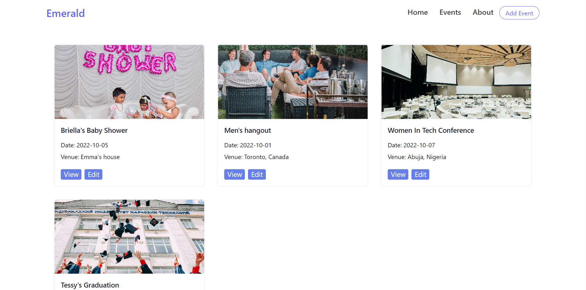

# FOOD ORDERING WEB APPLICATION

## About The Project 

A functional CRUD Application. By CREATING events, READING/VIEWING events, UPDATING events, and DELETING events that they have entered at a previous date, users of this event app are able to keep track of their events. Events information includes, event name, date, location, full details and event's image. Made use of Firebase to store the events.

## App Interface
 

## Technologies 

- React.js
- Tailwind CSS
- React-icons
- Firebase
- Framer Motion

## Roadmap 🔍

Here are some of the links you should look out for to make navigation on the site smooth for you. 

- Home Page
- Events List Page
- Add Event & Edit Event
- View Event
- Delete Event(not functional yet)

<!-- THE PRODUCT LINK -->

## Product 

Live site: (https://emerald-events.netlify.app/)

Project Github Repo Link: (https://github.com/OmaJuliet/Emerald.git)
